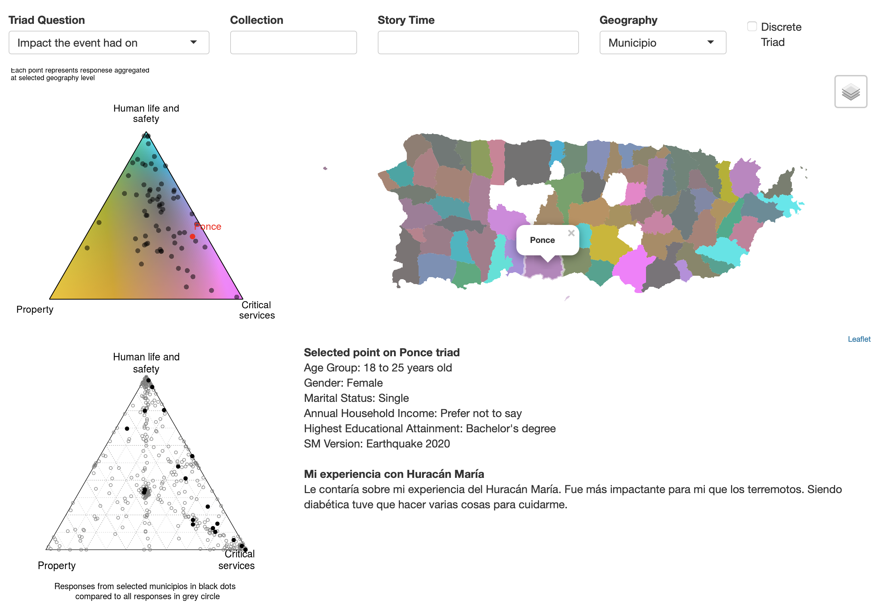

# Integrating Spatial and Ethnographic Methods for Resilience Research: A Thick Mapping Approach for Hurricane Maria in Puerto Rico
R shiny scripts for the Hurricane Maria Thick Map geoapp.
 
 

Carvalhaes, Thomaz and Rinaldi, Vivaldi and Goh, Zhen and Azad, Shams and Uribe, Juanita and Chester, Amy and Ghandehari, Masoud, Integrating Spatial and Ethnographic Methods for Resilience Research: A Thick Mapping Approach for Hurricane Maria in Puerto Rico (June 9, 2021). Available at SSRN: https://ssrn.com/abstract=3863657 or http://dx.doi.org/10.2139/ssrn.3863657

 
 
View the geoapp [here]( https://varinaldi.shinyapps.io/triadGeo/)

